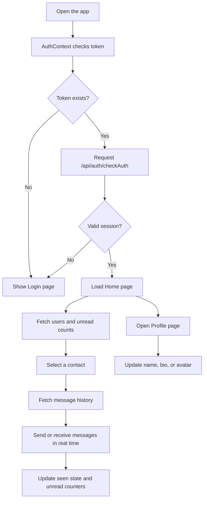

# Program Flow

---

## Main Application Flow

---

## What the User Can Do

- Sign up or log in.
- Stay authenticated with a token-backed session.
- Browse the active user list and search contacts.
- Open a chat and review previous messages.
- Send text, image, and file messages.
- See who is online in real time.
- Update profile details from the profile screen.
- Recover from invalid routes using the 404 page.
