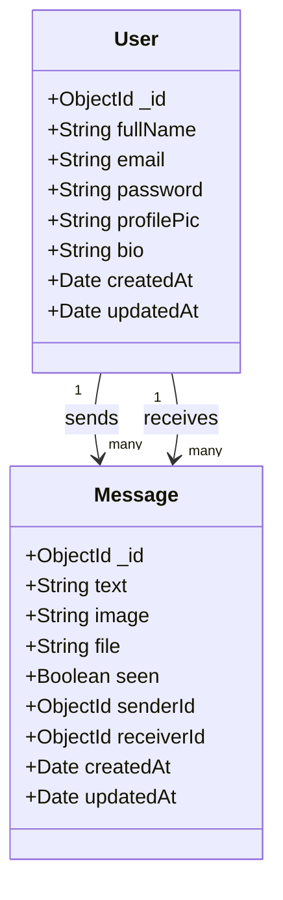
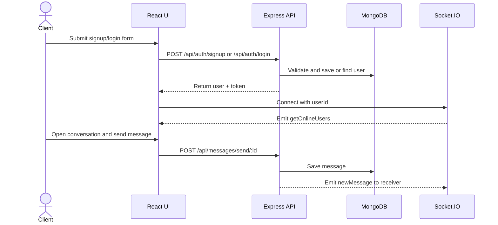

# UML Diagrams

---

## Class Diagram

```mermaid
classDiagram
    class User {
      +ObjectId _id
      +String fullName
      +String email
      +String password
      +String profilePic
      +String bio
      +Date createdAt
      +Date updatedAt
    }

    class Message {
      +ObjectId _id
      +String text
      +String image
      +String file
      +Boolean seen
      +ObjectId senderId
      +ObjectId receiverId
      +Date createdAt
      +Date updatedAt
    }

    User "1" --> "many" Message : sends
    User "1" --> "many" Message : receives
```

---

## Signup and Message Sequence

```mermaid
sequenceDiagram
    actor Client
    participant UI as React UI
    participant API as Express API
    participant DB as MongoDB
    participant Socket as Socket.IO

    Client->>UI: Submit signup/login form
    UI->>API: POST /api/auth/signup or /api/auth/login
    API->>DB: Validate and save or find user
    API-->>UI: Return user + token
    UI->>Socket: Connect with userId
    Socket-->>UI: Emit getOnlineUsers
    Client->>UI: Open conversation and send message
    UI->>API: POST /api/messages/send/:id
    API->>DB: Save message
    API-->>Socket: Emit newMessage to receiver
```
